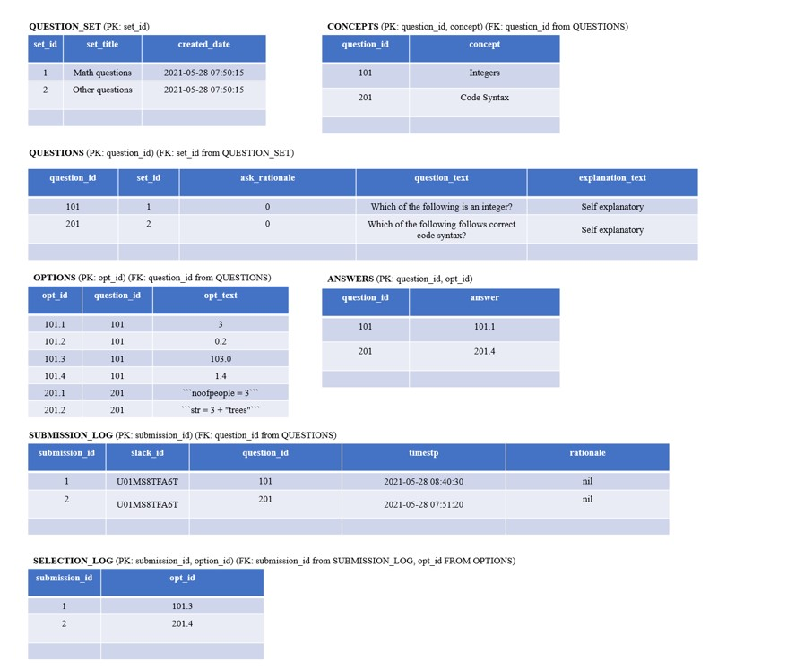

# odetoslack 
## Introduction
This is a Slack application which will be deployed through Zappa. Zappa is a Python package that bundles up the web application written in Flask and deploys to AWS Lambda. The backend database involved is MySQL database, which can be hosted on AWS RDS.

odetoslack is an education tool that allows students to answer quiz questions set by teachers. Interfaces have been added to allow teachers to create question sets, store questions as well as see statistics of students' attempts, all within Slack itself! 

## How to use the application
After setting up the whole application (refer to the next section), the following commands can be typed in from anywhere in the Slack workspace which the application is installed to:
- ```/quiz```: to activate the quiz (for students)
- ```/createset```: to create a question set (for teachers)
- ```/setquestions```: to create a question (for teachers)
- ```/stats```: to see the statistics of students' attempts (for teachers)

The last 3 commands can only be accessed by teachers, through the introduction of an additional interface to ask for a password before continuing on.

## Setting up
Note: Only Python 3.6, 3.7 or 3.8 is supported.

The below instructions include the setting up of access key on AWS (Step 5), the setting up of the MySQL database needed (Steps 11-13) and the creation of the application on Slack itself (Steps 14-18). If already completed prior, the respective steps can omitted. <br/>
Basic SQL and Python knowledge is assumed.

Instructions: <br/>
(This set of instructions is last updated on 16.6.2021) <br/>

1. Clone this repository. 

2. Using command prompt, navigate to the repository folder.

3. Activate virtual environment using: <br/>
    ```
    python -m venv venv
    venv\Scripts\activate
    ```
4. Run the below commands to install the necessary libraries:
    ```
   pip install Flask==1.1.2
   pip install zappa
   pip install slack_sdk
   pip install PyMySQL
   ```

5. Log into your AWS account. AWS Access Keys have to be created first. The below steps are referenced from [this link](https://docs.aws.amazon.com/IAM/latest/UserGuide/getting-started_create-admin-group.html). <br/>
    a. Type 'IAM' into the search box and at the left panel, select 'User groups' under 'Access Management'.<br/><br/>
    b. Create a new group and give it a name. <br/><br/>
    c. Under the 'Attach permissions policies' section, search for 'AdministratorAccess' and check the box. At the review screen, check the details and click 'Create Group'.<br/><br/>
    d. Head to 'Users' on the left panel and click on 'Add user'. <br/><br/>
    e. Give your new user a name and select the access type to be 'Programmatic access'. <br/><br/>
    f. Continuing on, add this user to the group just created. <br/><br/>
    g. Tags are optional. Moving on, review the details and click on 'Create user'. <br/><br/>
    h. Upon seeing the green Success screen, copy the access key id and secret access key to *~/.aws/credentials* (need to create a new folder and a new file). The secret access key will not be shown again. Take caution that the *.aws/* directory needs to be in your home directory and the *credentials* file do not have any extensions. <br/>
    DO NOT save the directory under version control. <br/>
    In the *credentials* file, copy and paste the text below and modify the XXXXXXXX portions accordingly.<br/>
    ```
    [default]
    aws_access_key_id = XXXXXXXX
    aws_secret_access_key = XXXXXXXX
   ```  
   
6. Create a new *app.py* file in the repository directory. Paste the following code within:
    ```
   from flask import Flask
   app = Flask(__name__)
   
   @app.route('/')
   def hello_world():
    return '<h1>Hello there!</h1>'
   
   # We only need this for local development.
   if __name__ == '__main__':
    app.run()
   ```
   The above is an example of a simple Flask application.

7. Next, on the command prompt, run ```zappa init``` in the repository directory. Follow through the configuration process to finish setting up the Zappa project. The below is an example of what could be set:
    ```
   environment: dev
   bucket: zappabucket346
   app's function: app.app
   whether to deploy the application globally: n
   ``` 
   For the app's function, it must end with ```.app```.

8. A *zappa_settings.json* file has been created. Check that ```"profile name:"``` is set to ```"default"```, which corresponds to the name defined in the square brackets specified in *~/.aws/credentials*. <br/>
    Add the following line of code within as well:
    ```
   "aws_region": "ap-southeast-1"
   ```
   The above can differ according to the region you are in.

9. Run the following line of code in command prompt:
    ```
   pip freeze > requirements.txt
   ```

10. Lastly, run the following command:
    ```
    zappa deploy dev
    ```
    You should see a success message with a URL stated. Take note of this HTTP endpoint. <br/><br/>
    From this point onwards, when changes are made to the *app.py* file, ```zappa update dev``` needs to be run to update the changes. <br/><br/> 
    Note: For the above, ```dev``` is to be replaced with what you named your environment in Step 7.

11. Now, head back to the AWS console and search for 'AWS RDS' in the search box. Click on 'Create database' and follow through the configurations to set up a database. <br/>
    The compulsory settings are: 
    - Engine type: MySQL
    - Enable public access under 'Connectivity'
    
    You will need to take note of the 'Master username' and your 'Master password'.

12. After the creation of the database, click into it and under 'Connectivity & security', note down the endpoint URL.
    
13. Connect to the database using any tool that allows MYSQL access, like MySQL workbench. The host will be the URL obtained from Step 12. <br/>
    Copy and run all the code found in *example.txt* in the repository folder. <br/>
    <b>IMPORTANT:</b> On the database tool, you will need to create a set under ```QUESTION_SET```, and a question under ```QUESTIONS```, together with its options under ```OPTIONS``` and the answer under ```ANSWERS```. When all is done, run the below code:
    ```
    INSERT INTO SUBMISSION_LOG (submission_id, slack_id, question_id, timestp, rationale) VALUE
    ("0", "10", "101", 'nil', "nil");
    ```
    The third field ```"101"``` is to be replaced by the question id of the first question inputted into the database. <br/>
    This line of code is a dummy entry, which serves to act as a counter for ```submission_id```.

14. Head to [this link](https://api.slack.com/apps) to start creating the Slack app. Pick 'From scratch' and give your app a name. Select the workspace to install the app to. 

15. Under 'Add features and functionality', click on 'Slash commands' and create the following commands:
    - ```/quiz```
    - ```/createset```
    - ```/setquestions```
    - ```/stats```
    
    For all request URLs, it will be the HTTP endpoint from Step 10, followed by the command itself. An example would be 'https://xxxxxxxx.execute-api.ap-southeast-1.amazonaws.com/dev/quiz'. <br/>
    Necessary changes have to be made to *code.py* if different commands are to be used.
    
16. On the left panel, click into 'Interactivity & Shortcuts' and under 'Interactivity', add the same HTTP endpoint followed by '/interactive'. An example would be 'https://xxxxxxxx.execute-api.ap-southeast-1.amazonaws.com/dev/interactive'. 

17. On the left panel, click into 'App Home' as well as 'Edit' under 'App Display Name' to add a bot user. 

18. On the left panel, click into 'Install App' under 'Settings' and approve the authorisation. You will see a bot user token. Take note of it.

19. Head back to the AWS console and search for 'AWS Lambda' in the search box. Click on the Zappa deployment set up and under the 'Configuration' tab, go to 'Environmental variables'. Set the following variables. 
    - Key: USER, Value: (this is the master user of the database created in Step 11)
    - Key: PASSWORD, Value: (this is the master password of the database created in Step 11)
    - Key: TOKEN, Value: (this is the token obtained from Step 18)
    - Key: SET_PASSWORD, Value: (this is the password that only allows teachers to create sets/ set questions/ see statistics; you can set this yourself)

20. Open up *code.py* in the repository document. Add in the database URL from Step 12 into Line 14, as well as the database ```quiz``` in Line 18. The name of the database can differ based on the SQL code you run in Step 13.

21. Copy and paste the code in *code.py* into *app.py*. Save the changes and remember to run ```zappa update dev``` in the command prompt to update the changes.

22. Congrats, you have finished the setting up! You can now try the app in Slack, enjoy quiz-zing!

## Note for teachers
The following shows the tables that will be set up in MySQL (some sample data is included). Take note of the primary and foreign keys, for example, to set a question in ```QUESTIONS```, it's set_id must be an existing id in ```QUESTION_SET```. <br/>

It is advisable to use numbers to denote set ids, question ids and option ids. An example would be ```set_id``` being ```1```, ```question_id``` being ```101```as well as ```opt_id``` being ```101.1```, ```101.2```, ```101.3``` and ```101.4```.

For the ```CONCEPTS``` table, no interface was created for it for the input of data. It was not included in ```/setquestions``` to prevent clutter. Entries can be inputted manually using any database tool like MySQL workbench.

# Acknowledgements
Credits to:
https://pythonforundergradengineers.com/deploy-serverless-web-app-aws-lambda-zappa.html
